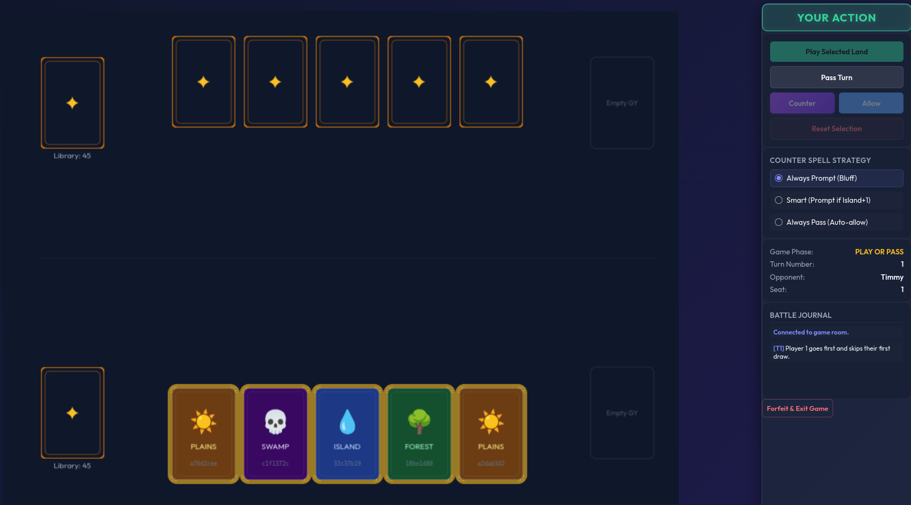

# Basic Land Game — Digital Edition

A two-player browser-based card game inspired by the Basic Land Game variant of Magic: The Gathering. Players race to assemble a winning set of lands before their opponent.

I host a build of this game at: <https://basic-land-game.robopenguins.com>

[](https://basic-land-game.robopenguins.com)

See <https://www.robopenguins.com/basic-land-game/> for a blog post on developing this game.

---

## Table of Contents

1. [Game Overview](#game-overview)
2. [How to Play](#how-to-play)
3. [The Lobby & Private Challenges](#the-lobby--private-challenges)
4. [Playing vs Bot](#playing-vs-bot)
5. [Counter Spell Bluff Setting](#counter-bluff-setting)
5. [Installation & Running the Server](#installation--running-the-server)
6. [Architecture Overview](#architecture-overview)

---

## Game Overview

Each player starts with a shuffled 50-card library — 10 copies each of the five basic land types (Forest, Island, Mountain, Plains, Swamp) — and draws an opening hand of 5 cards. Each turn, you draw one card and may play one land from your hand into your active zone.

**Win by achieving one of two conditions:**

- **Domain** — Have one of each of the five land types in your active zone.
- **Mono** — Have five copies of the same land type in your active zone.

Every land has a unique effect when played, making each play a potential turning point.

| Land | Effect |
|---|---|
| 🌳 Forest | Return any land from **your** graveyard back to your hand. |
| 💧 Island | Draw a card. *Or* discard Island + one other land to **counter** an opponent's land play. |
| 🔥 Mountain | Destroy one of your opponent's active lands. Target is declared before they can counter. |
| ☀️ Plains | Copy the effect of one of your other non-Plains active lands. Target is declared before the opponent can counter. |
| 💀 Swamp | Look at your opponent's full hand and choose one card for them to discard. The target is chosen *after* the counter window closes, so your opponent must commit to countering blind. |

**As far as I know, there's no official rule set for this game. I chose to use this rules set variation.**

---

## How to Play

### Turn Structure

1. **Draw** — The active player draws the top card from their library.
2. **Play or Pass** — You may either play one land from your hand (triggering its effect), or pass the turn without playing.
3. **Counter Window** — After a land is announced, the *inactive* player has a brief window to counter it (see below). If the land is countered, the players go back and forth with counters until one player passes.
4. **Effect Resolution** — If the land resolves, any targeting effects (Mountain, Forest, Swamp, Plains) are resolved by the active player.

### The Counter Window

After any land is announced, the non-active player may choose to **Counter** by discarding one Island plus one other land from hand. This sends the played land to the active player's graveyard with no effect.

### Using the Interface

- **Click a card in your hand** to play it.
- **Click a card in the active zone or graveyard** during effect resolution to choose a target. Targetable cards pulse with a gold glow.
- **"Pass Turn"** skips your land play for the turn, or skip your counter window.
- Hovering over any face-up card in your hand shows a tooltip with the land's effect.

### Timeouts

To avoid zombie player and games filling up the server, timeouts are enforced.

Players are kicked out of the lobby if they don't start a game within 15 minutes.

Players are kicked out of a game if a turn takes more than 15 minutes.

---

## The Lobby & Private Challenges

### Entering the Lobby

On the start screen, enter a display name (up to 32 characters) and click **"Enter Waiting Lobby"**. Your name is your identity for the session; tokens are stored in `localStorage` so you can safely refresh the page and your session will be restored.

### Open vs. Private Slots

The **"Play Against (optional)"** field lets you reserve your lobby slot for a specific opponent:

- **Leave it blank** — Your slot is visible to all other waiting players. Anyone can challenge you.
- **Enter a player's exact name** — Your slot becomes private. It will only appear in the lobby for the player whose name matches (case-insensitive). Nobody else will see your slot, so you can quietly arrange a match without being challenged by strangers.

When your slot is reserved, a lock banner is displayed at the top of your lobby panel as a reminder.

Challenging someone is instant — click their name in the waiting list to start a game. The server creates the match and both players are moved out of the lobby simultaneously.

---

## Playing vs Bot

Select the **🤖 vs Bot** tab on the start screen and click **"Play vs Bot"** to jump straight into a solo game — no display name or lobby matchmaking required.

This bot is not particularly smart, but I tried to give it enough logic to usually make reasonable moves.

---

## Counter Spell Bluff Setting

During a game, the sidebar includes a **Counter Spell Strategy** selector with three modes. This controls whether you are automatically prompted to counter each opponent land play or whether the client handles the decision for you:

| Mode | Behaviour |
|---|---|
| **Always Prompt (Bluff)** | You are always asked to Counter or Allow, *even when you have no Island*. This prevents your opponent from inferring your hand from the presence or absence of a counter prompt. Recommended for competitive play. |
| **Smart (Prompt if Island+1)** | You are only prompted when you actually hold an Island and at least one other land. Saves clicks but reveals information — your opponent will know you can never counter when no prompt appears. |
| **Always Pass (Auto-allow)** | The client automatically allows all land plays without prompting you. Best when you want to play fast and don't intend to counter. |

Your chosen strategy is remembered in `localStorage` between sessions.

---

## Installation & Running the Server

### Prerequisites

- Python 3.7 or later
- [uv](https://github.com/astral-sh/uv) (recommended) or `pip`

### Project Layout

```
.
├── server.py          # FastAPI application & all REST + WebSocket routes
├── game_board.py      # Pure game logic (no I/O dependencies)
├── game_ai.py         # Heuristic AI player
├── test_game_board.py # game_board.py unit tests
├── pyproject.toml     # Python project manifest & dependencies
└── static/
    ├── index.html     # Single-page game client
    ├── app.js         # Phaser scene, WebSocket client, UI logic
    └── styles.css     # All styling
```

### Install Dependencies

Using `uv`:

```bash
uv sync
```

Or using `pip`:

```bash
pip install fastapi uvicorn websockets httpx websocket-client
```

### Run the Server

```bash
python server.py
```

This starts uvicorn on `http://0.0.0.0:8000` with hot-reload enabled. Open your browser to `http://localhost:8000` to play.

Alternatively, run directly with uvicorn for more control:

```bash
uvicorn server:app --host 0.0.0.0 --port 8000 --reload
```

### Run in Docker

Build the Docker image:

```bash
docker build -t basic-land-game .   
```

Then to run on port 8000:

```bash
docker run -it --rm -p 8000:8000 basic-land-game:latest
```

To run in the background, you can use:

```bash
docker run -d --rm -p 8000:8000 basic-land-game:latest
```

### Health Check

```
GET /health
```

Returns the number of players currently waiting in the lobby and the number of active games — useful for confirming the server is up.

---

## Architecture Overview

The application is split into three layers: game logic, server, and client.

### `game_board.py` — Pure Game Logic

`BasicLandGame` is a self-contained state machine with no network or I/O dependencies. It tracks both players' libraries, hands, active zones, and graveyards. The server drives it forward by calling `apply_action(GameAction)`, which validates the action for the current `GamePhase` and returns an `ActionResult` (success flag, message, and new event log entries). The game progresses through four phases per turn: `DRAW → PLAY_OR_PASS → AWAIT_COUNTER → RESOLVE_EFFECT`, then back to `DRAW` for the next player. A separate `GAME_OVER` phase is set when a win condition is detected.

The win check runs after every action: Domain (all five types in active zone) and Mono (five of one type) are evaluated on `PlayerState.check_win()`.

### `server.py` — FastAPI Backend

The server is entirely in-memory (no database) and manages two collections: a waiting lobby and a map of running games.

**REST endpoints** handle lobby flow:
- `POST /lobby/join` — registers a name, returns an opaque `player_token` (UUID).
- `GET /lobby/waiting` — returns the personalised waiting list for the caller (reserved slots are filtered server-side).
- `POST /lobby/challenge` — matches two players, constructs a `BasicLandGame`, and notifies both via WebSocket push.
- `DELETE /lobby/leave` — removes the player from the waiting list.
- `POST /games/vs-ai` — creates an immediate solo game against the built-in AI; returns a `player_token` and `game_id` with no lobby step required.
- `GET /games/{game_id}/state` and `POST /games/{game_id}/action` — polling fallbacks; all normal play uses WebSockets.

**WebSocket channels** carry live updates:
- `/lobby/ws` — pushes `lobby_update` (personalised list) and `game_started` events.
- `/games/{game_id}/ws` — pushes `game_state` to both seats after every action. The client can also *submit* actions over this socket instead of the REST endpoint, which is what `app.js` does in practice.

State visible to each player is deliberately asymmetric: a player always sees their own full hand, but only the size and any revealed cards of the opponent's hand. The server rebuilds this view on every push via `_public_state_for(record, seat)`.

Authentication is token-based: every request after `/lobby/join` must supply `?player_token=<uuid>`. Tokens are stored in the client's `localStorage` enabling session restoration on page refresh.

### `static/` — Browser Client

The client is a single HTML page with two main JavaScript concerns:

**WebSocket & API layer** (`app.js`) maintains two persistent WebSocket connections (lobby and game), handles reconnection, serialises game actions, and applies incoming `game_state` messages to the UI. State relevant to counter automation (the strategy mode) is evaluated here before deciding whether to show the counter prompt or silently send `ALLOW_LAND`.

**Phaser 3 rendering** (`app.js`, `BasicLandGameScene`) draws the game board as a Phaser canvas injected into `#game-canvas-container`. Each card is a `CardUI` container (sprite + emoji text + short ID label) with hover animations and click events that feed back into the selection state. The board is fully redrawn (`drawBoard()`) on every incoming `game_state` push — opponent cards are rendered face-down unless revealed (e.g. by a Swamp effect). All card textures are generated programmatically at runtime; there are no image file dependencies.

The sidebar (`#game-sidebar`) is plain HTML/CSS and is updated in parallel with the Phaser canvas whenever game state changes.

The start screen has a **vs Human / vs Bot tab switcher**. The vs Bot tab calls `POST /games/vs-ai` directly and stores only the returned token and game ID — no lobby WebSocket is opened, and on exit the player is returned to the vs Bot tab rather than re-registered in the lobby.

## TODO
 - Add eye icon to indicate cards in hand that were revealed
 - Add customizable card art
 - Fix toasts to be more useful especially to explain AI turns
 - Fix event log including opponent card draw
 - Base animations on event log
 - Fix tooltips sometimes sticking around.
